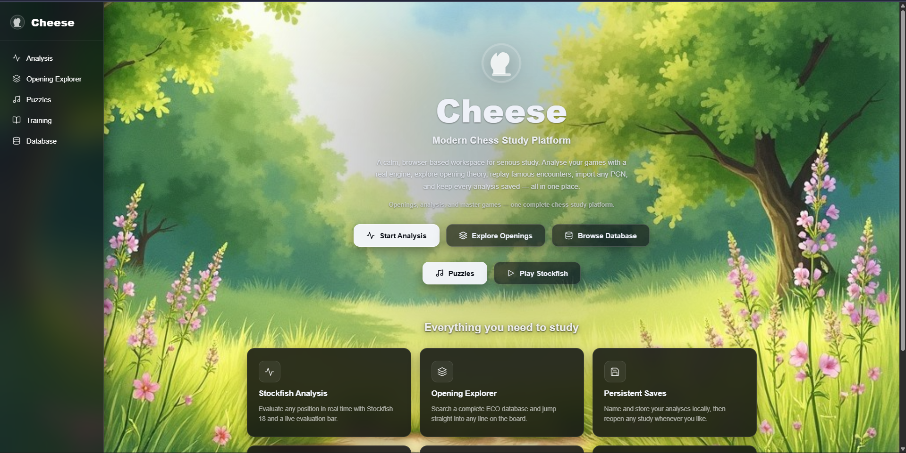
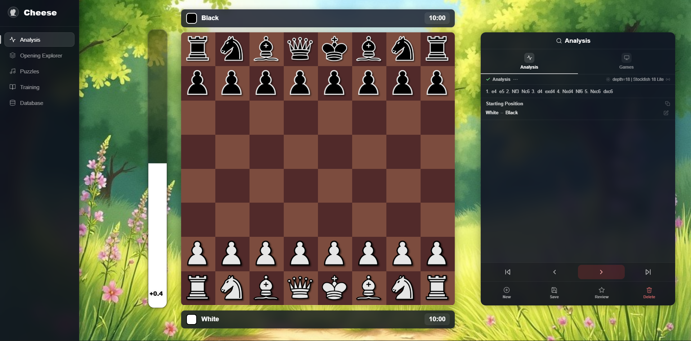
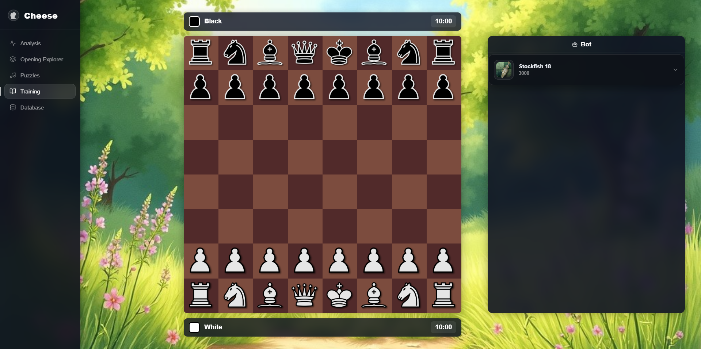

# Cheese

> A modern browser-based chess study platform.

**Live at [usecheese.xyz](https://usecheese.xyz)**

---

## Overview

**Cheese** is an all-in-one, desktop-focused chess study platform. It brings together everything you need to improve your game in one calm, cohesive workspace — analyse your games with a world-class engine, study openings, browse the greatest games ever played, train tactics, and sharpen your skills against Stockfish.

There is no account to create. The website itself is fully static and every board feature — analysis, openings, the database, playing Stockfish — runs entirely in your browser. The Puzzles page additionally talks to the Cheese API, a small backend that serves positions from a database of 1.7 million tactics puzzles, sampled across every difficulty from the full 5.8 million–puzzle Lichess import (see [`server/`](server/)).

---

## Features

Everything below is available in **Version 1.3**.

| Feature | Description |
| --- | --- |
| **Stockfish 18 Analysis** | Analyse any position with the Stockfish 18 engine, including an evaluation bar and engine lines. |
| **Puzzle Trainer** | Train tactics against a database of 1.7 million puzzles, filtered by difficulty, with hints and session tracking. |
| **Opening Explorer** | Browse openings by ECO code and hand off any line straight into Analysis. |
| **Play Against Stockfish** | Play full games versus the engine — choose your colour, with automatic board orientation and turn enforcement. |
| **Master Game Database** | Explore curated collections of games from legendary players, parsed dynamically from PGN. |
| **Local Save System** | Save your analyses locally in the browser and revisit them anytime. |
| **PGN Import** | Load games via PGN and review them move by move. |
| **Move Navigation** | Step forwards and backwards through any game with a clean move list. |
| **Modern Glassmorphism UI** | A consistent dark, glassmorphism-inspired interface across every page. |
| **No Build Step** | The website is plain HTML, CSS and JavaScript — no bundler, no framework. |

---

## Project Structure

| Path | Contents |
| --- | --- |
| `index.html`, `pages/` | The static website — one folder per page |
| `assets/` | Shared CSS, JS, pieces, sounds and images |
| `engine/` | Stockfish 18 (WebAssembly) |
| `library/` | Static content: ECO openings, master game PGNs |
| `server/` | The Cheese backend API — see [`server/README.md`](server/README.md) |

The website and the API deploy independently. Only the Puzzles page depends on
the API; every other page works without it. The website is hosted on
Cloudflare Pages; the API runs on Railway (see
[`server/README.md`](server/README.md)).

---

## Upcoming Features

These are planned for future releases:

- **User accounts** — cloud-synced progress and saved analyses
- **Puzzle themes** — filter training by tactical motif
- **Mobile Support** — a fully responsive experience for phones and tablets
- **More master games** — additional players and expanded collections
- **Additional improvements** — ongoing polish and quality-of-life updates

---

## Screenshots

_Screenshots will be added here._

**Home**

**Analysis**

**Database**

**Training**

---

## Technologies Used

| Technology | Role |
| --- | --- |
| **HTML5** | Page structure |
| **CSS3** | Styling, layout, and glassmorphism design |
| **JavaScript** | Application logic (vanilla, no framework) |
| **chess.js** | Move generation, legality, and game state |
| **Stockfish 18** | Chess engine (WebAssembly, runs in a Web Worker) |
| **PGN parsing** | Reading and splitting master games and imports |
| **Node.js + Express** | Backend API (Puzzles only) |
| **SQLite** | Puzzle datastore (1.7M rows served, sampled from a 5.8M import) |

---

## Design Philosophy

Cheese is built to be a **calm, distraction-free environment for studying chess**. The interface stays quiet and out of the way so the board and your analysis remain the focus, while a modern, consistent look keeps the whole experience cohesive from page to page. The goal is simple: a study platform that feels focused, polished, and pleasant to spend time in.

---

## Version

This README corresponds to **Version 1.3**.

---

## License

This project is licensed under the **GNU General Public License v3.0 (GPL-3.0)**.

You are free to use, study, share, and modify Cheese under the terms of the GPL-3.0. Any distributed derivative works must remain under the same license. See the [LICENSE](LICENSE) file for the full text.

© 2026 Vihaan Productions™

---

## Thank You

Thanks for checking out **Cheese**! Your interest and feedback are genuinely appreciated. Enjoy your study, and happy analysing.
